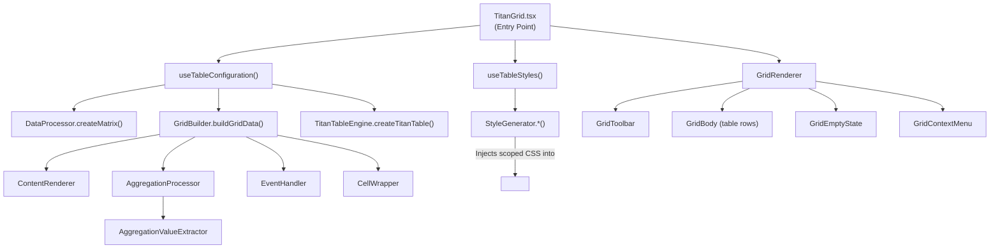
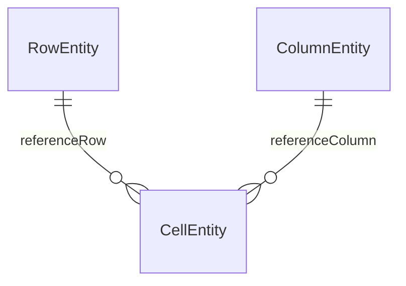
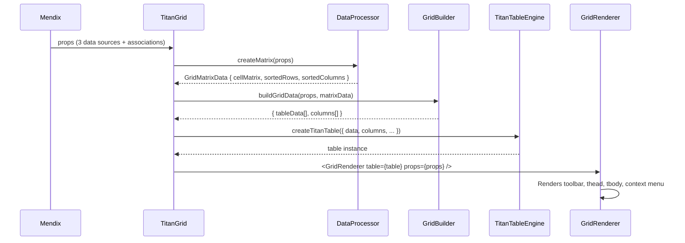

# TitanGrid Pro Widget — Full Codebase Analysis

## 1. Project Overview

A **Mendix Pluggable Widget** that renders a customisable data grid using **React** and a bespoke in-house table engine (`TitanTableEngine`). The widget follows a **matrix-style association pattern** — it takes three separate data sources (Cells, Rows, Columns) and joins them via Mendix reference associations to build a pivot-style grid.

| Property | Value |
|---|---|
| **Widget ID** | `deera.titangrid.TitanGrid` |
| **Package Path** | `deera` |
| **Author** | Deepak |
| **Platform** | Web only |
| **Mendix SDK** | `@mendix/pluggable-widgets-tools ^10.15.0` |
| **React** | 18.2.x (via overrides/resolutions) |
| **Runtime Dependencies** | **None** — all table, virtualizer, and XLSX logic is custom-built |

---

## 2. File Inventory & Architecture

```
src/
├── TitanGrid.tsx                ← Main widget entry point
├── TitanGrid.xml                ← Widget property definition (~80 properties)
├── TitanGrid.editorConfig.ts    ← Studio Pro conditional property visibility
├── TitanGrid.editorPreview.tsx  ← Design-time preview component
├── engine/
│   └── TitanTableEngine.ts      ← Custom headless table engine (replaces @tanstack/react-table)
├── components/
│   ├── GridRenderer.tsx         ← Thin orchestrator: assembles toolbar, table, empty state, context menu
│   ├── GridToolbar.tsx          ← Search bar, export buttons, column visibility toggle
│   ├── GridContextMenu.tsx      ← Right-click context menu (export, print)
│   └── GridEmptyState.tsx       ← Empty state message when no rows match filters
├── hooks/
│   ├── CellWrapper.tsx          ← Wrapper adding data-* attributes for custom cell coordination
│   ├── useTableConfiguration.ts ← Core state hook: builds matrix data, columns, and table instance
│   ├── useTableStyles.ts        ← Injects scoped CSS into <head> via useEffect
│   ├── usePrintGrid.ts          ← Handles print mode via hidden iframe
│   ├── useExportHandlers.ts     ← CSV and Excel export logic
│   └── useIsMounted.ts          ← Mounted-state guard hook
└── utils/
    ├── DataProcessor.ts         ← Builds the cell matrix (row × column → cell)
    ├── GridBuilder.ts           ← Creates TitanTableEngine column defs + row data
    ├── ContentRenderer.ts       ← Renders attribute / dynamicText / custom widget content
    ├── StyleGenerator.ts        ← Named exported functions for dynamic CSS generation
    ├── AggregationProcessor.ts  ← Calculates sum/avg/count/min/max/first/last
    ├── AggregationValueExtractor.ts ← Extracts numeric values from Mendix objects
    ├── ExcelExporter.ts         ← Custom in-house .xlsx file generator (no third-party library)
    ├── ChangeTracker.ts         ← Global DOM-level input change detection for aggregation refresh
    ├── EventHandler.ts          ← Single/double click dispatch to Mendix actions
    ├── Logger.ts                ← Centralised debug/warn/error logging utility
    └── FeatureConfig.ts         ← Feature flags and configuration interface
```

### Architecture Diagram



### Domain Model Pattern (Star Schema)



---

## 3. Data Flow



---

## 4. Current Feature Map

### ✅ Implemented & Working

| Feature | Status | Details |
|---|---|---|
| **3-datasource matrix** | ✅ | Cell ↔ Row ↔ Column association pattern |
| **Cell rendering modes** | ✅ | Attribute, Dynamic Text, Custom Widgets |
| **Row header rendering** | ✅ | Attribute, Dynamic Text, Custom, None |
| **Column header rendering** | ✅ | Attribute, Dynamic Text, Custom, First Row, None |
| **Row aggregation (footer)** | ✅ | sum/avg/count/min/max/first/last, built-in + custom |
| **Column aggregation (right col)** | ✅ | Same functions, built-in + custom |
| **Grand total cell** | ✅ | When both row & column aggregation enabled |
| **Custom aggregation content** | ✅ | Widget drop zones for custom footer/column |
| **Aggregation from custom widgets** | ✅ | Extracts values via Mendix object symbol introspection |
| **Aggregation positioning** | ✅ | Top/Bottom for rows, Left/Right for columns |
| **Click events** | ✅ | Cell, Row, Row Header, Column, Column Header |
| **Single/Double click** | ✅ | Configurable trigger type |
| **Column resizing** | ✅ | Drag-to-resize column borders |
| **5 grid themes** | ✅ | Alpine, Material, Bootstrap, Dark, Minimal |
| **Custom colors** | ✅ | Header bg, even/odd rows, hover, borders |
| **Alternating rows** | ✅ | Configurable even/odd colors |
| **Row hover effects** | ✅ | Configurable hover color |
| **Font size** | ✅ | 10/12/14/16px |
| **Row height modes** | ✅ | Auto, Compact, Comfortable, Spacious, Manual |
| **Column width modes** | ✅ | Auto, Manual, Equal, Resizable |
| **Grid dimensions** | ✅ | Width, Height, Min/Max constraints |
| **Scrollbar customisation** | ✅ | Modern, Minimal, Classic, Hidden + width |
| **Responsive behaviour** | ✅ | Breakpoints, mobile height, responsive scrollbars |
| **Tooltips** | ✅ | Cell, Row, Column tooltips via Mendix expressions |
| **Dynamic CSS classes** | ✅ | Cell, Row, Column dynamic class expressions |
| **Corner header** | ✅ | Dynamic text or custom widget |
| **Editor preview** | ✅ | Rich Studio Pro preview with sample data |
| **Editor config** | ✅ | Conditional property visibility |
| **Change detection** | ✅ | DOM-level input/change listener for aggregation recalc |
| **Column pinning/freezing** | ✅ | Sticky Top/Bottom rows and Left/Right columns |
| **Sorting** | ✅ | Built-in column header sorting (asc/desc/none) |
| **Global filtering** | ✅ | Search input in toolbar, real-time |
| **Column inline filters** | ✅ | Per-column filter popup |
| **Pagination** | ✅ | Row-Wise and Column-Wise with configurable page size |
| **Export (CSV/Excel)** | ✅ | Custom CSV generation and custom .xlsx export |
| **Column hiding** | ✅ | Toolbar panel to toggle column visibility |
| **Column reordering** | ✅ | Drag-and-drop column reordering at runtime |
| **Mobile card view** | ✅ | Card-based responsive layout for small screens |
| **Printing** | ✅ | Dedicated print mode via context menu or toolbar |
| **Tooltip HTML** | ✅ | HTML-capable tooltips with dynamic content |

### 🔲 Stubbed / Not Yet Implemented

| Feature | Status | Notes |
|---|---|---|
| **Cell editing shortcut** | 🔲 Stub | `FeatureConfig.ts` has interface, no implementation |
| **Row selection** | 🔲 | Not started; planned in roadmap |
| **Keyboard navigation** | 🔲 | Basic focus ring in CSS; no JS arrow-key logic |

---

## 5. Coding Standards Applied

All source files comply with the following standards (Mendix Marketplace requirements):

| Standard | Status |
|---|---|
| Lower camelCase for all variable and function names | ✅ |
| Functions ≤ 200 lines, single responsibility | ✅ |
| JSDoc on all exported functions, hooks, and interfaces | ✅ |
| Functional components and hooks over class components | ✅ |
| No class-based static methods (converted to named exports) | ✅ |
| Descriptive variable and function names in JS and XML | ✅ |

---

## 6. Dependency Analysis

| Dependency | Type | Purpose |
|---|---|---|
| `@mendix/pluggable-widgets-tools` | devDependency | Build, lint, and release tooling |
| `@types/big.js` | devDependency | TypeScript types for decimal arithmetic |
| `react` / `react-dom` | peer (provided by Mendix) | UI rendering runtime |
| `@tanstack/react-table` | ❌ Removed | Replaced by `TitanTableEngine` |
| `@tanstack/react-virtual` | ❌ Removed | Replaced by custom row virtualizer in `TitanTableEngine` |
| `zipcelx` | ❌ Removed | Replaced by `ExcelExporter.ts` |

---

## 7. Widget Property Organisation (XML)

The widget property structure follows a logical, tab-based flow matching Studio Pro conventions:

1. **Data Source** — Cell, Row, and Column data source and association mapping
2. **Look & Feel** — Themes, colors, dimensions, and responsive settings
3. **Advanced Grid Tools** — Aggregations, pagination, sorting, filtering, pinning
4. **Events** — Click actions for cell, row, row header, column, column header
5. **Export & Print** — CSV/Excel export options and print settings
6. **Mobile** — Breakpoints and card view configuration
